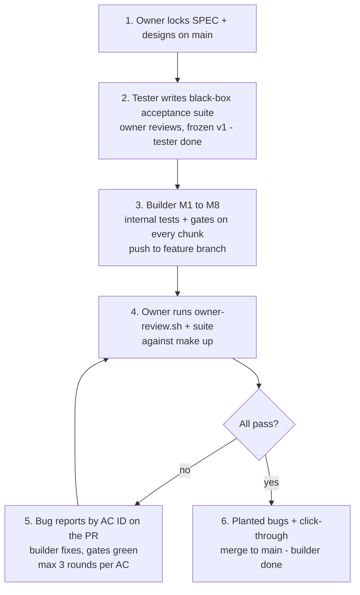
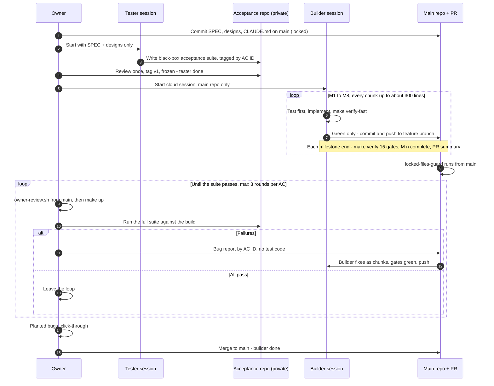
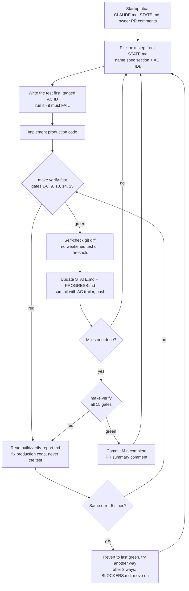

# Validation model — how we know the build is really correct

Owner document. Read-only for the agent.
This is the go-to validation model for this project, decided by the owner in
`decisions/0001-validation-approach.md`: **single builder + black-box acceptance suite**.

## 1. The problem

The builder agent writes the code, writes the tests, runs them and says "done".
1,000 green tests prove only that code and tests agree with each other. They do not
prove that the tests match the spec. The agent can also, under pressure, weaken tests or
gates to get green.

Rule: the thing that decides "done" must be outside the builder agent's control.

## 2. The model in one line

The builder builds everything and validates every small chunk with its own tests and the
15 gates. A black-box acceptance suite, written before the build by a separate tester
session that never sees the code, decides whether the result is accepted.

Trade-off accepted: full autonomy for the builder; a weakness in its own tests is found
late (after M8) by the black-box acceptance suite or planted bugs. Its internal tests and
gates still catch most bugs at once, on every chunk.

## 3. The process in 6 steps

1. Owner locks `docs/SPEC.md` and `docs/design/` on `main`.
2. Tester session writes the black-box acceptance suite; owner reviews it; frozen as `v1`.
   **Tester done.**
3. Builder goes through M1 to M8, with internal tests and gates on every chunk, pushing to
   `feature/feature-flag-service`.
4. Owner runs `scripts/owner-review.sh` and the full suite against `make up`.
5. Failures → bug reports by AC ID on the PR → builder fixes them (gates green) → back to
   step 4. Max 3 rounds per AC, then the owner decides.
6. All pass → planted bugs → click-through → merge to `main`. **Builder done.**

Default: the suite runs once, after M8. Optional: also after M3, M4, M5 and M7 for earlier
detection (section 4.3). The builder does not stop for these.



## 4. When each check runs

### 4.1 End-to-end



### 4.2 Builder loop for one chunk (spec 12.4, 12.6)



| Check | Who runs it | When | Decides |
| --- | --- | --- | --- |
| `make verify-fast` | Builder | Every chunk, before commit | Chunk may be committed |
| `make verify` (15 gates) | Builder | Every milestone end | Milestone may be marked complete |
| Agent CI on the PR | GitHub, from the agent's branch | Every push | Signal only; the agent can edit it |
| `locked-files-guard` | GitHub, from `main` | Every push to the PR | Alert comment if locked files changed (does not block) |
| Owner review + black-box acceptance suite | Owner, from `main` | After M8 (optional: earlier, 4.3) | Build accepted, or bug reports |
| Planted bugs + click-through | Owner | Final review | Merge to `main` |

### 4.3 Optional earlier suite runs

| After | Builder finished | Suite tests that should now pass |
| --- | --- | --- |
| M3 | Auth | Login API, AC-EVAL-1, 2, 4, `ERR-*` 401 / 403 |
| M4 | Admin API, audit | AC-GRP-1…5, AC-FLAG-1…6, AC-AUD-1 at API level; admin `ERR-*` |
| M5 | Evaluation API, cache | AC-EVAL-3, 5, 6, 7; AC-CACHE-4 (visible part) |
| M7 | UI features | UI parts of AUTH, GRP, FLAG; AC-AUD-2 |

## 5. Layers of checking

| Layer | Who writes it | What it proves |
| --- | --- | --- |
| Builder's unit / integration / e2e tests (spec 11) | Builder | Code does what the builder understood |
| Mutation testing, PIT (spec gate 7) | Tool | Builder's backend tests really assert something |
| Traceability + integrity gates (spec gates 14, 15) | Builder, checked by owner review | Every AC has a test; no skipped tests or lowered thresholds |
| Black-box acceptance suite | Tester session, reviewed by owner | Running system meets spec 11.2, independent of the builder |
| Owner review script | Owner, from `main` | Locked files and values unchanged, no weakened tests, suite passes |
| Planted bugs | Owner, at review | Builder's tests catch real bugs |
| Manual click-through | Owner, at review | It works and looks right for a person |

Coverage of the black-box acceptance suite: 30 ACs fully, 2 partly (AC-CACHE-4, 6), plus
every `ERR-*` case. AC-AUTH-5 is removed (decision 0002: rate limiting at the edge); 39
criteria are active. The 7 white-box ACs (AC-CACHE-1, 2, 3, 5, 7, 8, AC-AUD-3) rely on the
builder's tests and PIT.

## 6. What is outside the builder's control

| Item | Where | Why the builder cannot change it |
| --- | --- | --- |
| `docs/SPEC.md`, `docs/design/**`, `CLAUDE.md`, this file, `decisions/**` | `main` branch | The builder works on `feature/feature-flag-service`; `main` keeps the owner's copy |
| Locked paths list, hook, review script | `scripts/locked-paths.txt`, `.claude/hooks/`, `scripts/owner-review.sh` | Hook blocks edits; owner runs the `main` copy |
| Black-box acceptance suite | Separate private repo | The builder never sees it |

CI on the builder's branch is NOT trusted: the builder can edit `.github/workflows/ci.yml`
on its branch. A green PR is a signal, not proof. Only the owner review counts.

### 6.1 Where the black-box acceptance suite lives

Separate private repo `feature-flag-acceptance`. Never a folder or branch in this repo.

| Rule | Why |
| --- | --- |
| Separate repo, never a branch here | A clone and `git fetch` download every branch. Blocking fetch is a text rule the agent can get around, and the builder needs fetch for its startup ritual |
| Claude GitHub app has access to this repo only | Otherwise a cloud session could clone the suite repo |
| Suite repo stays private | Even when this repo is public |
| Suite uses no code from this repo | It only calls the running app: UI `http://localhost:3000`, API `http://localhost:8080` |
| Written before M1 by a separate tester session, then frozen as `v1` | Input is only `docs/SPEC.md` and `docs/design/` |
| Tests follow `docs/black-box-testing.md` in the suite repo | One definition: allowed interfaces, expected values only from the spec, design techniques |
| Run by the owner review script from `main` | `make up`, then the suite from the owner's local clone |
| After final acceptance it may be copied here as regression tests | Secrecy only matters while the builder is building |

### 6.2 Public repo and branch protection on `main`

The repo is public so branch protection is available on a personal account.

| Setting | Value | Why |
| --- | --- | --- |
| Require a pull request before merging | On, 0 approvals | Approvals cannot work: builder and owner use the same GitHub account |
| Do not allow bypassing the above settings | On | The rules also apply to the owner's account, which the builder uses |
| Allow force pushes / deletions | Off | No history rewrite on `main` |
| Who merges | Owner only, after the owner review | Builder rule in `CLAUDE.md` section 8. With 0 approvals and one account, GitHub cannot enforce this; the alert comment and the owner review script show locked-file changes, and every merge is visible in history |
| Locked-files alert | `locked-files-guard` (not a required check) | `.github/workflows/locked-files-guard.yml` on `pull_request_target`: runs `main`'s copy and `main`'s `scripts/locked-paths.txt`; uses no actions; never runs PR code. On every PR to `main` it posts or updates one PR comment listing changed locked paths and commit hashes. It does not block: it can be worked around, and only the owner merges. The hard check is `scripts/owner-review.sh` before every merge |
| `CODEOWNERS` | Owner on locked paths | A record of ownership only, not enforcement |

### 6.3 Protection from outside

Strangers can comment, open issues and send pull requests from forks. Anything a stranger
writes is untrusted input for the builder and for GitHub Actions.

GitHub settings (owner sets them; check again before every builder run):

| # | Setting | Value | Why |
| --- | --- | --- | --- |
| 1 | Moderation → Interaction limits | "Limit to repository collaborators", 6 months; renew before it expires | Strangers cannot comment, open issues or open PRs |
| 2 | Features: Issues, Discussions, Wiki, Projects | Off | Fewer places for untrusted text. PR comments still work |
| 3 | Collaborators | None | Only the owner account can push |
| 4 | Actions → Fork pull request workflows | "Require approval for all external contributors" | A fork PR cannot start a workflow without the owner |
| 5 | Actions → Workflow permissions | "Read repository contents" by default | A workflow gets write access only where it asks for it |
| 6 | Repository secrets | None | Nothing to steal; the project needs none in v1 |
| 7 | `pull_request_target` workflows | Never check out or run PR code; read-only token; no secrets; untrusted PR fields never in shell commands | They run with this repo's token, so PR code must never execute in them |
| 8 | `escalation-notify.yml` | Acts only on comments by the owner's login; permissions only `issues: write`, `pull-requests: write` | Strangers cannot trigger pings or labels |

Builder rules for untrusted input: `CLAUDE.md` section 8a.

## 7. Owner review

1. From a clean `main` checkout: `scripts/owner-review.sh` (default branch
   `origin/feature/feature-flag-service`; `--no-suite` skips Docker). It checks:
   locked files, locked values (coverage 80/70, PIT 60, Playwright retries 0 and
   repeat-each 2, `maxDiffPixelRatio` 0.01, k6 targets, banned dependencies, verbatim
   acceptance criteria), weakened tests, and runs the black-box acceptance suite.
   Report: `build/owner-review-<time>.md`.
2. Planted bugs: on a scratch branch, break about 5 things by hand (return `false`
   instead of 404, skip the cache update after a toggle, allow a duplicate key, ...).
   Each must turn at least one of the builder's tests red. A bug that stays green = weak spot.
3. Manual click-through: `make up`, walk the spec 11.2 checklist and
   `docs/design-compare/index.html`.

## 8. Feedback to the builder

Failures go back as a PR comment by the owner, one per AC:

```
BUG REPORT · AC-EVAL-6
Observed: GET /api/v1/evaluate/flags with the old ETag still returns 304 after a flag toggle.
Expected (spec 7.2, 11.2): 200 with a new ETag.
Fix the general behaviour; do not special-case inputs.
```

Allowed: AC ID, spec section, observed vs expected in plain words, HTTP method, path,
status, input category. Not allowed: test code, test file names, exact payloads, stack
traces. Max 3 rounds per AC, then the owner decides.

## 9. Status

| Item | Status |
| --- | --- |
| Validation model | Decided: `decisions/0001` (single builder + black-box acceptance suite) |
| Black-box acceptance suite repo `feature-flag-acceptance` | Skeleton created; tests not written yet |
| `scripts/owner-review.sh` | Created and tested on a bad and a clean branch |
| Edit-block hook | Created: `.claude/hooks/block_locked_files.py`, list in `scripts/locked-paths.txt`. Owner sessions: `FF_OWNER_SESSION=1 claude` |
| `locked-files-guard.yml` | Created as a non-blocking alert (PR comment). Path comparison tested locally; the comment step runs only on GitHub |
| GitHub settings (6.2, 6.3) | Owner to set |
| Account spend limit | Owner to set |

Phase 2 (later, if we continue): Stryker frontend mutation testing. PIT covers the backend
only; adding Stryker needs a spec change (new gate and dependency).
